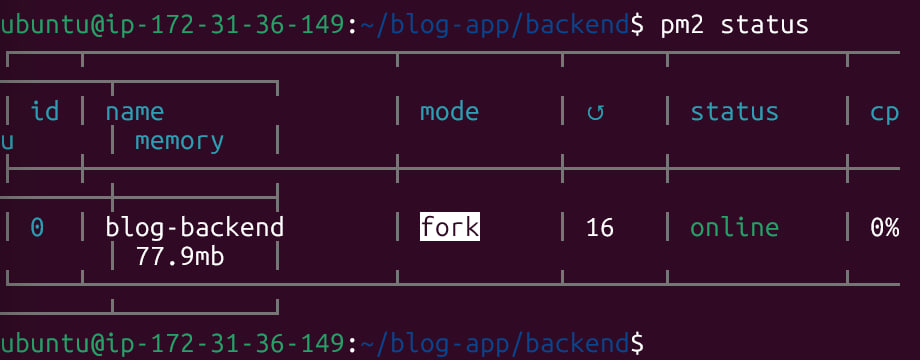

#  MERN Stack App Deployment with Terraform & Ansible

##  Project Goal

Deploy a MERN Stack Blog Application using:
- **Terraform** to provision AWS infrastructure (EC2, S3, IAM)
- **Ansible** to configure the backend environment
- **MongoDB Atlas** as the database
- **AWS S3** for frontend hosting and media uploads
- **PM2** to run the backend server on EC2

---

## Tools & Services Used

| Tool / Service     | Purpose                                      |
|--------------------|----------------------------------------------|
| Terraform          | Provision EC2, S3 buckets, and IAM user      |
| Ansible            | Configure EC2 with Node.js, PM2, environment |
| AWS EC2            | Host the backend server                      |
| AWS S3             | Host frontend and store uploaded media       |
| MongoDB Atlas      | Database for the blog                        |
| PM2                | Run and manage backend process               |

---

## Project Structure

week11-assignment/
├── terraform/
├── ansible/
├── screenshots/

---

##  Step-by-Step Deployment

###  Terraform – Infrastructure Setup
- Created `main.tf` to provision:
  - EC2 instance
  - Security group (ports 22, 80, 5000)
  - S3 bucket for frontend
  - S3 bucket for media uploads
  - IAM user with access keys for S3

###  MongoDB Atlas
- Created a free cluster
- Whitelisted the EC2 public IP
- Generated the connection string and used it in the backend `.env`

###  Ansible – EC2 Configuration
- Defined the server in `inventory`
- Playbook tasks:
  - Clone blog app from GitHub
  - Create `.env` from `env.j2` template
  - Install Node.js v18 using `nvm`
  - Install PM2 globally
  - Install backend dependencies and start with PM2

###  Frontend Deployment to S3
- Built frontend using `npm run build`
- Uploaded the `build/` folder to the frontend S3 bucket via AWS CLI
- Enabled static website hosting on S3

---

##  Testing

- Frontend is accessible via S3 URL ✅
- Media uploads are stored correctly in the media S3 bucket ✅
- PM2 shows the backend is running ✅
- MongoDB Atlas shows saved blog posts ✅

---

##  Screenshots

| Screenshot               | Description                          |
|--------------------------|--------------------------------------|
|           | PM2 showing backend running          |
|       | MongoDB Atlas cluster dashboard      |
|  | Media upload success confirmation    |
|           | Frontend working via S3 URL          |

---

##  Difficulties Faced & Solutions

| Issue                                       | Solution                                                                 |
|--------------------------------------------|--------------------------------------------------------------------------|
| PM2 failed due to old Node.js version      | Used `nvm` to install Node.js v18                                        |
| MongoDB connection error                   | Whitelisted EC2 IP in MongoDB Network Access settings                    |
| S3 public access policy errors             | Added `aws_s3_bucket_public_access_block` to enable public access        |
| Ansible failed due to existing local files | Added `force: yes` in Git clone task                                     |

---

##  Cleanup

- Ran `terraform destroy` to remove all infrastructure
- Deleted the IAM user and associated keys
- Removed `.terraform/`, `.env`, and any sensitive files from the repo

---

##  Notes

- AWS Access Keys are **not included**
- `.gitignore` is set to exclude sensitive files
- All required screenshots are saved in the `/screenshots/` folder

